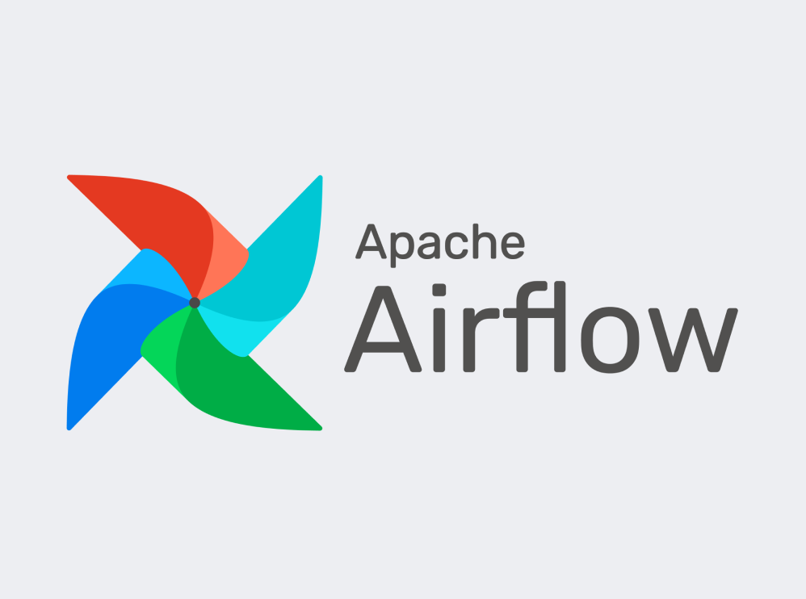

# House-Prices-Prediction

Este proyecto tiene como objetivo predecir los precios de casas utilizando técnicas de aprendizaje automático. Se emplea un conjunto de datos con características como  número de habitaciones, baños, tamaño del terreno y antigüedad. Aplicando el modelo de RandomForest para obtener predicciones precisas. Además, se realiza una exploración de datos y análisis estadístico previo para entender las variables más influyentes. Los resultados permiten estimar el valor de propiedades y apoyar decisiones de compra o venta.

## 📁 Estructura del Proyecto
- dags/ : Esta carpeta contiene el cosigo fuente de los DAGs(Directed Acyclic Graphs) , para orquestar el flujo de trabajo . Las tareas del DAG permiten automatizar procesos como la extraccion ,transformcaion y carga(ETL)
- env/ : Entorno virtual para ejecucion  en el entorno local.
- model/ : Contiene los codigos de el API, llamda al modelo de ML , creacion y experimentacion del modelo  , Analisis exploratorio , archivo docker y  librerias a importar.
- scripts/ : Esta carpeta contiene el codigo para realizar el ETL , que es llamdao a traves de una tarea que conforman el DAG.
- docker-compose.yaml : Archivo que contiene el codigo para crear los contenedores.
- dockerfile : Archivo que contiene el codigo para crear la imagen de airflow y instalar dependencias.
- load : notebook para carga de data al DataLake.

## ⚒️ Tecnologias⚒️

 

    <!-- Lenguajes de Programación -->
    
    <!-- Bibliotecas y Frameworks de Machine Learning -->
    
    
    <!-- Entornos de Despliegue y MLOps -->
    
    
    
    
    
    
    

